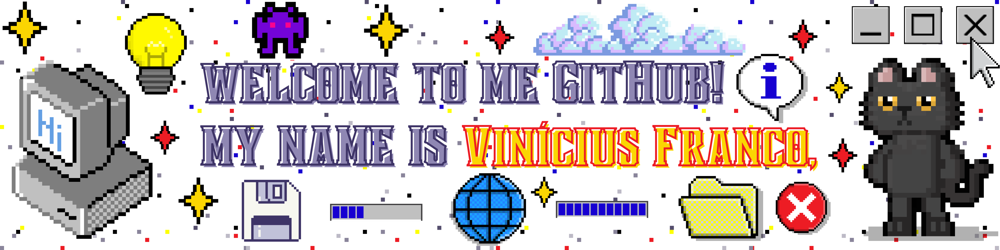

<br>

<div align="center">
  <a href="https://github.com/vfrancomoreira">
    
  </a>
</div><br>

<div align="center">
    <a href="mailto:viniciusfsantosm15@gmail.com">
        
    </a>
    <a href="https://www.linkedin.com/in/vin%C3%ADcius-franco/">
        
    </a>
    <a href="https://instagram.com/vinicius__franco_" target="_blank">
    </a>
    <br>
    <a href="https://github.com/vfrancomoreira?tab=repositories">
        
    </a>
    <a href="https://github.com/vfrancomoreira?tab=followers">
        
    </a>
    
</div>
</br>

```python
#!/usr/bin/env python
# -*- coding: utf-8 -*-

class RPAAutomationDev:

    def __init__(self):
        self.name = "Vinícius"
        self.age = 24
        self.specialty = "RPA - Automação de Processos Robóticos"
        self.education = "Análise e Desenvolvimento de Sistemas - FIT (Faculdade Impacta de Tecnologia)"
        self.passion = "transformar tarefas repetitivas em soluções inteligentes e eficientes"
        self.focus = "aprender mais, evoluir minhas habilidades e encarar novos desafios na área da tecnologia"

    def about(self):
        return (
            f"Sou desenvolvedor especializado em {self.specialty}, tenho {self.age} anos, "
            f"aficionado por {self.passion}.\n\n"
            f"Sou graduado em {self.education}, e estou sempre em busca de {self.focus}.\n\n"
            "Por aqui, você vai encontrar alguns dos meus projetos, estudos e experimentos. "
            "Fique à vontade pra explorar!\n"
            "Obrigado pela visita, espero que ache algum dos meus trabalhos interessantes, "
            "e se quiser trocar uma ideia, é só chamar!"
        )

if __name__ == "__main__":
    dev = RPAAutomationDev()
    print(dev.about())
```
<br>

---
## Tecnologias e Ferramentas

**Linguagens de Programação:**


**Serviços em Nuvem:**


**Ferramentas e Serviços:**


## Estatísticas

<p>
  
  
</p>
